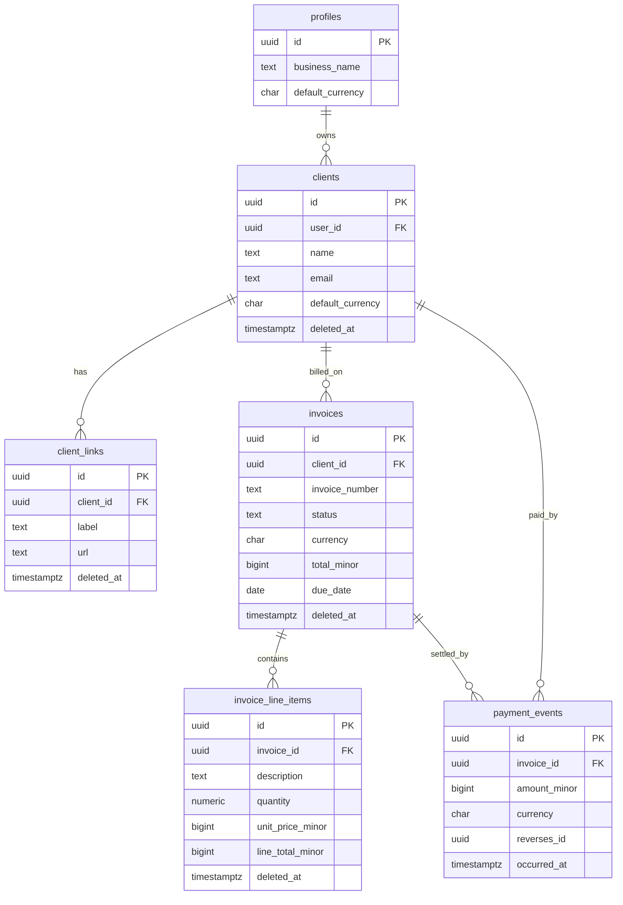

# Clario — Product Requirements Document (v1 / MVP)

> **Audience:** This PRD is written to be ingested by an AI coding agent (Claude Code, Antigravity, or similar). It is prescriptive by design. Where a decision has already been made, it is stated as a rule, not an option. Sections marked **[GUARDRAIL]** are non-negotiable invariants the agent must preserve across every task.

---

## 1. Product summary

**Clario** is an offline-first workspace that reduces the friction of managing the *financial* side of freelance client work.

The core job: let a solo creative freelancer answer — instantly, without app-hopping — *"Has this client paid? Which invoices are still outstanding? How much do they still owe me?"* Supporting client context (contacts, notes, document links) sits alongside the money workflow to remove the "where did I save that?" hunt, but it is not the reason the app is opened.

**What Clario is not:** not an invoicing app (invoicing is table stakes, an *input* to payment clarity), not a generic client hub, not an everything-app that tries to absorb WhatsApp / email / banking.

**The differentiator — offline-first.** Because Clario is local-first, the device is the source of truth. The app is *always instant and always available*: open any client and see full financial state with no spinner, network or not. Invoices, their PDFs, and payments can all be created offline and sync automatically on reconnect. Cloud-first incumbents cannot cheaply retrofit this. Universal appeal; sharpest in patchy-connectivity markets, which is the seed market.

---

## 2. Target user

Solo creative freelancers — designers, developers, writers, marketers — who work with multiple clients, don't want an accounting suite or a heavy CRM, and frequently work on unreliable connections.

---

## 3. Scope

### 3.1 In scope (v1 / MVP)
- Email-based authentication and a single-user account per freelancer.
- Client profiles (contact details + free-text notes).
- **Document links** — labeled URLs attached to a client (not file uploads).
- Invoices with line items, multi-currency, an explicit lifecycle (draft → sent → void), and a user-editable invoice number.
- Manual payment recording (full or partial) via an **append-only payment ledger**.
- Payment corrections via **reversal entries** (the ledger is never mutated in place).
- Per-client financial view: invoice list, payment history, outstanding balance (per currency).
- Dashboard: outstanding invoices, recent payments, earnings — all grouped by currency.
- On-device invoice PDF generation (works offline).
- Full offline-first behaviour with background sync and a visible sync-status indicator.
- Installable PWA.

### 3.2 Deferred (fast-follows — explicitly out of v1)
- True file/binary uploads (introduces a separate binary-sync problem — see §4.4).
- Per-invoice document links (v1 links are per-client only).
- AI-drafted payment reminder messages.
- Overdue auto-notifications / reminders.
- Payment-processor integration and auto-reconciliation.
- Business logo on invoices (a binary asset — deferred with file uploads).
- Multi-currency FX conversion / a single "reporting currency" (v1 shows per-currency totals only).
- Team / multi-user / client-facing portals.

---

## 4. Architecture

### 4.1 Stack (locked)
| Layer | Choice |
|---|---|
| Language | TypeScript (end-to-end) |
| Framework | Next.js (App Router) |
| Hosting | Vercel |
| UI | React + Tailwind CSS + shadcn/ui (Radix under the hood) |
| Backend data | Supabase — Postgres + Auth |
| Offline sync engine | PowerSync (Cloud; self-hostable Open Edition is the pricing escape hatch) |
| On-device store | SQLite via the PowerSync client SDK |
| PDF generation | On-device (pdf-lib or @react-pdf/renderer) |

### 4.2 Data-flow model
- **Reads:** the UI reads from the **local SQLite database** through the data-access layer (§8). Reads never block on the network; they are reactive/live queries so the UI updates as local data changes.
- **Writes:** the UI writes to the **local SQLite database**. PowerSync queues those local mutations and uploads them to Supabase Postgres via the **upload connector** (§8.3) when connectivity is available.
- **Downstream sync:** PowerSync streams relevant Postgres rows back down to each device according to **sync rules** (§7.3), scoped per user.
- **Source of truth:** the local device for the current session; Supabase Postgres is where all devices converge.

### 4.3 **[GUARDRAIL] Core data invariants**
These hold across the entire codebase and every future change:

1. **Money is stored as integer minor units** (e.g. cents, kobo) — never floats, never decimals-as-floats. Every monetary column is a signed 64-bit integer plus an ISO-4217 `currency` char(3). Formatting to a human string happens only at the display edge.
2. **Money is event-sourced.** Payments live in an **append-only ledger** (`payment_events`). Rows are **immutable**: no updates, no deletes. A correction is a new **reversal** row. Balances and payment status are **derived by summing the ledger**, never stored as an authoritative mutable field.
3. **All primary keys are client-generated UUIDs** (UUID v4) so records can be created offline without a server round-trip.
4. **Deletes are soft.** Every user-mutable table has a nullable `deleted_at`. "Deleting" sets the timestamp (a sync-friendly update). No hard deletes from the client. (`payment_events` is exempt — it is append-only and immutable; a payment is "removed" via a reversal entry, never a delete.)
5. **Every synced row carries `user_id`.** Row-Level Security and PowerSync sync rules both scope strictly to the authenticated user. A user can only ever read or write their own rows.
6. **Never sum across currencies.** Any total (outstanding, earnings, client balance) is grouped by currency. No implicit conversion in v1.
7. **The PowerSync dependency is confined to the data-access layer (§8).** PowerSync SDK types and calls must not leak into React components, business logic, or route handlers. Swapping the sync engine later must touch only §8.

### 4.4 Why document links instead of file uploads (context for the agent)
File uploads are deliberately excluded from v1. Everything else in v1 is small, structured, relational text data that flows through PowerSync's relational sync path and merges trivially offline. Binary files would require a *second, harder* offline-sync system (Supabase Storage + a bespoke binary upload queue with retry/dedup/progress, plus on-device caching decisions and large-file handling over exactly the metered, unreliable connections we optimize for). v1 ships **document links** (labeled URLs) — a plain text field that syncs like any other and answers "where did I save the contract?" without taking on the binary problem.

---

## 5. Data model

All timestamps are UTC (`timestamptz`). All monetary amounts are `bigint` minor units. All ids are `uuid`.

### 5.1 Entity-relationship overview


### 5.2 Table specifications

#### `profiles`
Extends Supabase `auth.users`. One row per user, `id` equals the auth user id.

| Column | Type | Notes |
|---|---|---|
| `id` | uuid PK | = `auth.users.id` |
| `business_name` | text | shown on invoices; nullable |
| `business_address` | text | free text; nullable |
| `default_currency` | char(3) | ISO-4217; default `'USD'` |
| `created_at` | timestamptz | default now() |
| `updated_at` | timestamptz | last-write-wins |

#### `clients`
| Column | Type | Notes |
|---|---|---|
| `id` | uuid PK | client-generated |
| `user_id` | uuid FK → profiles.id | **[GUARDRAIL] required, RLS-scoped** |
| `name` | text | required |
| `email` | text | nullable |
| `phone` | text | nullable |
| `company` | text | nullable |
| `notes` | text | free-text client context; nullable |
| `default_currency` | char(3) | pre-fills new invoices for this client |
| `created_at` | timestamptz | |
| `updated_at` | timestamptz | last-write-wins |
| `deleted_at` | timestamptz | soft delete; nullable |

#### `client_links` (document links)
| Column | Type | Notes |
|---|---|---|
| `id` | uuid PK | |
| `user_id` | uuid FK | required |
| `client_id` | uuid FK → clients.id | required |
| `label` | text | e.g. "Signed contract", "Project brief"; required |
| `url` | text | must validate as an absolute `http(s)` URL |
| `created_at` | timestamptz | |
| `updated_at` | timestamptz | |
| `deleted_at` | timestamptz | soft delete |

#### `invoices`
| Column | Type | Notes |
|---|---|---|
| `id` | uuid PK | |
| `user_id` | uuid FK | required |
| `client_id` | uuid FK → clients.id | required |
| `invoice_number` | text | user-editable string; default = suggested next number (§6.3) |
| `status` | text | enum: `'draft' \| 'sent' \| 'void'` — **user-controlled lifecycle only** |
| `currency` | char(3) | snapshotted at creation; all line items and payments must match |
| `total_minor` | bigint | **cached** sum of line totals; recomputed on any line-item write |
| `issue_date` | date | nullable until sent |
| `due_date` | date | nullable; used to derive overdue |
| `notes` | text | terms / memo, **rendered on the PDF**; nullable |
| `internal_note` | text | private note, **never rendered on the PDF**; always editable in any status; nullable |
| `created_at` | timestamptz | |
| `updated_at` | timestamptz | last-write-wins |
| `deleted_at` | timestamptz | soft delete (only permitted while `status = 'draft'`) |

> `status` never stores `paid` or `overdue` — those are **derived** (§6.1). Storing them would break ledger integrity.

#### `invoice_line_items`
| Column | Type | Notes |
|---|---|---|
| `id` | uuid PK | |
| `user_id` | uuid FK | required |
| `invoice_id` | uuid FK → invoices.id | required |
| `description` | text | required |
| `quantity` | numeric(12,3) | default 1 |
| `unit_price_minor` | bigint | minor units, may be 0 |
| `line_total_minor` | bigint | cached = round(quantity × unit_price_minor) |
| `position` | integer | ordering within the invoice |
| `created_at` | timestamptz | |
| `updated_at` | timestamptz | |
| `deleted_at` | timestamptz | soft delete |

#### `payment_events` — **[GUARDRAIL] append-only, immutable**
| Column | Type | Notes |
|---|---|---|
| `id` | uuid PK | |
| `user_id` | uuid FK | required |
| `invoice_id` | uuid FK → invoices.id | required |
| `client_id` | uuid FK → clients.id | denormalized for per-client queries; required |
| `amount_minor` | bigint | **signed**: positive = payment received, negative = reversal/refund |
| `currency` | char(3) | must equal the invoice currency |
| `method` | text | fixed list: `'cash' \| 'bank_transfer' \| 'card' \| 'mobile_money' \| 'other'` |
| `note` | text | nullable |
| `occurred_at` | date | when the payment actually happened (user-set) |
| `reverses_id` | uuid FK → payment_events.id | nullable; set on reversal entries for audit |
| `created_at` | timestamptz | insert time |

> No `updated_at`, no `deleted_at`. Rows are never changed or removed. This is what makes offline merges conflict-free: two devices each appending events simply union, and the summed balance is order-independent.

---

## 6. Derived read model (computed, never stored authoritatively)

These are computed in the data-access layer via local SQLite queries so they work offline. Implement as pure, tested functions.

### 6.1 Per-invoice
```
amount_total   = invoice.total_minor                          (cached sum of line_total_minor)
amount_paid    = SUM(payment_events.amount_minor WHERE invoice_id = X)   // signed sum
balance_due    = amount_total - amount_paid
payment_status = 'paid'           if balance_due <= 0 and amount_total > 0
               = 'partially_paid' if 0 < amount_paid < amount_total
               = 'unpaid'         otherwise
is_overdue     = status == 'sent' AND balance_due > 0 AND due_date < today()
display_status = 'draft'   if status == 'draft'
               = 'void'    if status == 'void'
               = 'paid'    if status == 'sent' and payment_status == 'paid'
               = 'overdue' if status == 'sent' and is_overdue
               = 'sent'    otherwise            // sent, unpaid or partially paid, not yet overdue
```

### 6.2 Aggregates
```
client.outstanding_balance  = per currency: SUM(balance_due) over that client's non-void 'sent' invoices with balance_due > 0
dashboard.total_outstanding = per currency: SUM(balance_due) over all non-void 'sent' invoices with balance_due > 0
dashboard.recent_payments   = latest N payment_events (amount_minor > 0), newest first, with client + invoice context
dashboard.earnings          = per currency: SUM(amount_paid) over a selectable period (default: last 30 days), reversals included
```
**[GUARDRAIL]** Every aggregate above is **grouped by currency**. The UI renders one figure per currency; it must never add two currencies together.

### 6.3 Invoice numbering (offline-safe)
- On new-invoice creation, suggest a default `invoice_number` computed **locally**: take the max numeric suffix among the user's existing invoice numbers and increment (e.g. `INV-0007` → `INV-0008`). Fall back to `INV-0001`.
- The field is **user-editable**. Uniqueness per user is a **soft** constraint: if a duplicate is detected locally, warn but do not block (blocking would break offline creation and multi-device edge cases). Do not enforce a hard unique DB constraint on `(user_id, invoice_number)`.

---

## 7. Backend: Supabase & PowerSync configuration

### 7.1 Row-Level Security (all tables)
Enable RLS on every table. Policy pattern (illustrative for `clients`; replicate per table):
```sql
-- SELECT / UPDATE / DELETE: owner only
create policy "own rows - select" on clients
  for select using (auth.uid() = user_id);
create policy "own rows - modify" on clients
  for all using (auth.uid() = user_id) with check (auth.uid() = user_id);
```
`payment_events`: allow `insert` and `select` for the owner; **explicitly deny `update` and `delete`** (no policy granting them) to enforce append-only at the database level.

### 7.2 Migrations
Manage schema with the Supabase CLI (`supabase/migrations`). Every schema change is a migration checked into the repo. No manual dashboard edits to schema.

### 7.3 PowerSync sync rules
Bucket data per user so each device only syncs its owner's rows. Illustrative `sync-rules.yaml`:
```yaml
bucket_definitions:
  user_data:
    parameters: select request.user_id() as user_id
    data:
      - select * from clients        where user_id = bucket.user_id
      - select * from client_links   where user_id = bucket.user_id
      - select * from invoices       where user_id = bucket.user_id
      - select * from invoice_line_items where user_id = bucket.user_id
      - select * from payment_events where user_id = bucket.user_id
      - select * from profiles       where id = bucket.user_id
```

### 7.4 Local schema (PowerSync client)
Mirror the synced tables in the PowerSync client schema (SQLite). Money columns are `integer`; ids and text are `text`; timestamps stored as ISO-8601 text. Provide typed wrappers in the data-access layer.

---

## 8. Data-access layer (the API surface) — **[GUARDRAIL] the sole PowerSync boundary**

There is no traditional REST API for reads/writes; the app is local-first. The "API" is a typed **repository layer** that the UI and business logic call. This layer is the *only* place that imports the PowerSync SDK.

### 8.1 Repository interfaces (contract — implement in TypeScript)
```ts
interface ClientRepo {
  list(): LiveQuery<ClientSummary[]>;              // reactive, excludes soft-deleted
  get(id: string): LiveQuery<ClientDetail | null>; // includes derived outstanding_balance (per currency)
  create(input: NewClient): Promise<string>;       // returns new uuid
  update(id: string, patch: ClientPatch): Promise<void>;
  softDelete(id: string): Promise<void>;
}

interface ClientLinkRepo {
  listForClient(clientId: string): LiveQuery<ClientLink[]>;
  add(clientId: string, label: string, url: string): Promise<string>; // validates URL
  update(id: string, patch: { label?: string; url?: string }): Promise<void>;
  softDelete(id: string): Promise<void>;
}

interface InvoiceRepo {
  listForClient(clientId: string): LiveQuery<InvoiceSummary[]>;   // includes display_status, balance_due
  get(id: string): LiveQuery<InvoiceDetail | null>;              // includes line items + derived fields
  suggestNextNumber(): Promise<string>;
  create(input: NewInvoice): Promise<string>;                    // status defaults to 'draft'
  update(id: string, patch: InvoicePatch): Promise<void>;        // draft only for most fields
  setLineItems(id: string, items: LineItemInput[]): Promise<void>; // recomputes total_minor
  markSent(id: string, issueDate: string, dueDate: string): Promise<void>; // draft -> sent
  void(id: string): Promise<void>;                               // -> void
  softDelete(id: string): Promise<void>;                         // draft only
}

interface PaymentRepo {
  listForInvoice(invoiceId: string): LiveQuery<PaymentEvent[]>;
  listForClient(clientId: string): LiveQuery<PaymentEvent[]>;
  record(input: NewPayment): Promise<string>;    // appends a positive event; currency must match invoice
  reverse(eventId: string, note?: string): Promise<string>; // appends a negative mirror event with reverses_id
}

interface DashboardRepo {
  outstandingByCurrency(): LiveQuery<CurrencyTotal[]>;
  recentPayments(limit: number): LiveQuery<PaymentWithContext[]>;
  earningsByCurrency(periodDays: number): LiveQuery<CurrencyTotal[]>;
}

interface SyncStatus {
  observe(): LiveValue<{ connected: boolean; lastSyncedAt: string | null; pendingUploads: number }>;
}
```

### 8.2 Rules for this layer
- All reads are **live queries** bound to local SQLite; the UI re-renders on local change.
- All writes go to local SQLite first (optimistic, instant); PowerSync handles upload.
- Derived values (§6) are computed here, in SQL or TypeScript, and unit-tested.
- `PaymentRepo.record` and `.reverse` **only ever insert** into `payment_events`. There is no update/delete path.
- URL validation lives here for `client_links`.

### 8.3 Upload connector (local write → Supabase)
Implement PowerSync's `uploadData` connector to translate queued local CRUD ops into Supabase writes:
- `PUT`/`PATCH` ops → Supabase upsert/update on the corresponding table (RLS enforces ownership).
- Soft deletes arrive as normal updates (`deleted_at` set).
- `payment_events` ops are insert-only; the connector must reject any non-insert op on that table (defensive: matches the DB-level append-only policy).
- On auth/permission errors, surface for re-auth; on transient network errors, let PowerSync retry.

---

## 9. User stories & acceptance criteria

Format: acceptance criteria are testable. **Every** story implicitly inherits: *works fully offline; changes persist locally and sync on reconnect; only the authenticated user's data is visible.*

### Epic 0 — Auth & account
**0.1** *As a freelancer, I can sign up and sign in with email so my data is private to me.*
- [ ] Supabase Auth with **email + password** and **Google Sign-In**, both available on the sign-in screen.
- [ ] Signing in with Google using an email that already has a password account **links identities** into the same account (matching verified email) rather than creating a duplicate.
- [ ] OAuth redirect URIs registered per environment; Vercel preview URLs covered by the Supabase redirect allow-list.
- [ ] On first sign-in a `profiles` row is created with `default_currency = 'USD'` (user-editable in settings).
- [ ] After initial sign-in, an existing session lets the app open and read cached data **offline** (no forced re-auth while offline).
- [ ] Signing out clears the local database.

**0.2** *As a freelancer, I can set my business name, address, and default currency so invoices and new records use them.*
- [ ] Settings screen edits `profiles`.
- [ ] `default_currency` pre-fills new clients and invoices.

### Epic 1 — Clients
**1.1** *Create / edit / delete a client.*
- [ ] Required: `name`. Optional: email, phone, company, notes, default currency.
- [ ] Email, if present, is format-validated.
- [ ] Delete is a soft delete; deleted clients disappear from lists but their invoices/payments remain in the ledger and in aggregates unless those invoices are themselves removed.
- [ ] Created offline, a client is usable immediately (has a UUID) and syncs later.

**1.2** *View a client's profile with all context in one place.*
- [ ] Shows contact details, notes, document links, invoice list, payment history, and **outstanding balance per currency**.

### Epic 2 — Document links
**2.1** *Attach labeled links to a client so I stop hunting through Drive.*
- [ ] Add a link with a `label` and `url`; URL must be a valid absolute http(s) URL or the save is blocked with an inline error.
- [ ] Links list per client; each opens in a new tab.
- [ ] Edit and soft-delete a link.
- [ ] **Out of scope (must NOT build in v1):** file upload, link previews, server-side fetching, Drive/Dropbox auth, per-invoice links.

### Epic 3 — Invoices
**3.1** *Create an invoice for a client with line items in a chosen currency.*
- [ ] New invoice defaults: `status='draft'`, `currency` = client's default currency, `invoice_number` = suggested next number (editable).
- [ ] Add/edit/reorder/remove line items (description, quantity, unit price in minor units).
- [ ] `total_minor` recomputes on every line-item change and equals the sum of `line_total_minor`.
- [ ] All amounts stored as integer minor units; the UI formats them per the invoice currency.

**3.2** *Mark an invoice as sent.*
- [ ] `draft → sent` sets `issue_date` and `due_date`.
- [ ] **Locking is gated on payments, not on status.** While `status = 'sent'` and the invoice has **zero** `payment_events`, financial fields (line items, amounts, currency, invoice number, issue date) remain editable — the freelancer can fix a mistake and regenerate the PDF. Rationale: Clario never transmits the invoice; `sent` is a self-declared status, and with no payments attached, edits recompute cleanly because balance and status are derived.
- [ ] Once the invoice has **one or more** `payment_events`, financial fields lock. Corrections then go via void + reissue (invoice error) or a payment reversal (payment error).
- [ ] `due_date` is **always** editable in any status — extending a deadline does not rewrite what was billed.
- [ ] `internal_note` is **always** editable and never appears on the PDF.

**3.3** *Void an invoice.*
- [ ] `sent → void` (or `draft → void`) removes it from outstanding/earnings aggregates while preserving the record and its history.

**3.4** *See each invoice's status at a glance.*
- [ ] Badge reflects `display_status` (§6.1): Draft, Sent, Partially paid, Paid, Overdue, Void.
- [ ] Overdue is derived live from `due_date` and balance — not a stored flag.

### Epic 4 — Payments (append-only ledger)
**4.1** *Record a full or partial payment against an invoice.*
- [ ] Records a positive `payment_events` row; `currency` must equal the invoice currency (enforced).
- [ ] `occurred_at` defaults to today, user-editable; optional method and note.
- [ ] Invoice `balance_due`, `payment_status`, and `display_status` update immediately from the ledger sum.
- [ ] Recording multiple partial payments correctly reduces the balance to zero and flips status to Paid.

**4.2** *Correct a mistaken payment.*
- [ ] "Reverse" appends a negative mirror event with `reverses_id` set; the original row is never edited or deleted.
- [ ] Balance and status recompute accordingly.
- [ ] **[GUARDRAIL]** There is no UI or code path that updates or deletes an existing `payment_events` row.

**4.3** *Offline payment integrity.*
- [ ] Two payments recorded on two offline devices for the same invoice both survive sync (union), and the resulting balance equals the sum of both — no lost writes.

### Epic 5 — Client financial view
**5.1** *See a client's outstanding balance and full payment history.*
- [ ] Outstanding balance shown **per currency**.
- [ ] Payment history lists all events (including reversals) newest-first with amounts, dates, and the invoice each belongs to.

### Epic 6 — Dashboard
**6.1** *See the state of my freelance finances at a glance.*
- [ ] Outstanding invoices total **per currency**, with a count and a drill-down list.
- [ ] Recent payments (configurable N, default 10) with client + invoice context.
- [ ] Earnings for a selectable period (default last 30 days) **per currency**.
- [ ] **[GUARDRAIL]** No figure mixes currencies. If the user has invoices in NGN and USD, they see two separate lines.
- [ ] **Progressive disclosure:** the dashboard renders one row/tile per currency. With a single currency it must look like an ordinary dashboard — no currency selector, no "all currencies" label, no multi-currency chrome of any kind.
- [ ] Ordering: the user's `default_currency` first, then remaining currencies by amount descending.
- [ ] Outstanding rows show amount + invoice count + overdue count, and drill into a filtered invoice list.
- [ ] Earnings renders one tile per currency governed by a single shared period selector.
- [ ] Recent payments needs no currency grouping — each row displays its own currency inline; nothing is aggregated.
- [ ] With more than three currencies, show the top three by amount and collapse the remainder behind a "+N more" affordance.
- [ ] **Never** provide a currency filter that hides money, an "all currencies" total, or a converted equivalent — a hidden currency could conceal an unpaid invoice, which is the exact failure the product exists to prevent.

### Epic 7 — Invoice PDF
**7.1** *Generate a professional invoice PDF, even offline.*
- [ ] PDF is generated **on-device** (no server round-trip) and can be produced with zero connectivity.
- [ ] Includes business identity (name/address from profile), client details, line items, totals in the invoice currency, invoice number, issue/due dates.
- [ ] User can download/share the PDF via the platform share sheet.
- [ ] (Logo is deferred — do not add image upload to satisfy this.)

### Epic 8 — Offline-first & sync
**8.1** *Work seamlessly regardless of connectivity.*
- [ ] All read screens render from local data with no network dependency and no spinner-on-load once initial sync has happened.
- [ ] Creating clients, invoices, line items, and payments works fully offline.
- [ ] A visible **sync-status indicator** shows connected/offline, last-synced time, and count of pending uploads (from `SyncStatus`, §8.1).
- [ ] On reconnect, queued writes upload automatically and the indicator clears.

### Epic 9 — PWA
**9.1** *Install Clario like an app.*
- [ ] Valid web manifest (name, icons, theme, display: standalone) and a service worker so the app shell loads offline.
- [ ] Installable on mobile and desktop; launches to the dashboard.

---

## 10. Non-functional requirements
- **Correctness of money:** integer minor units everywhere; all derivations unit-tested including multi-partial-payment and reversal cases.
- **Performance:** local reads feel instant (< 16ms query targets for typical datasets of hundreds of clients / thousands of invoices).
- **Offline resilience:** app is fully usable after first sync with the network disabled; no unhandled promise rejections on write-while-offline.
- **Security:** RLS on every table; append-only enforced at the DB for `payment_events`; no service-role key ever shipped to the client.
- **Accessibility:** keyboard-navigable, labelled inputs, sufficient contrast (shadcn/ui + Radix baseline, verified).
- **Design bar:** pixel-perfect, consistent spacing/typography; held to review before ship.

---

## 11. Deployment strategy

### 11.1 Environments
- **Supabase:** one project (dev) + one project (prod), schema managed by CLI migrations. RLS enabled from the first migration.
- **PowerSync:** a PowerSync Cloud instance per environment, connected to the corresponding Supabase Postgres via logical replication; sync rules (§7.3) deployed per environment.
- **Vercel:** Next.js app with Preview deployments per PR and a Production deployment on the main branch.

### 11.2 Secrets / env
- Client-exposed: Supabase URL + anon key, PowerSync instance URL. 
- Server-only: none required for v1 (no server mutations, no processor). **Never** expose the Supabase service-role key to the client.
- Auth token flow: Supabase session JWT is passed to PowerSync for sync authorization.

### 11.3 CI/CD (gstack-style loop)
- On PR: typecheck, lint, unit tests (money/derivation logic), build. Deploy Vercel Preview.
- Manual QA gate: **offline test** — load the app, disable network, create a client + invoice + payment, re-enable, confirm clean sync and no data loss.
- On merge to main: run migrations against prod Supabase, deploy PowerSync sync rules, deploy Vercel Production, then a canary check of the critical path (sign in → create invoice → record payment → see dashboard update).

### 11.4 Pricing posture (informational)
Both PowerSync and Supabase free tiers comfortably cover development and early MVP validation; Clario's per-user data is kilobytes. First realistic cost is Supabase Pro when paying users warrant no-auto-pause + backups, then PowerSync Pro as concurrent devices grow. The PowerSync **Open Edition** (self-hostable) is the escape hatch if managed pricing ever bites — an ops change, not a code change, because the sync dependency is confined to §8.

---

## 12. Resolved decisions (locked — do not re-litigate)

1. **Auth:** email + password **and** Google Sign-In, both in v1. Supabase Auth handles both. Identity linking on matching *verified* email so a user signing up by password and later using Google lands in the same account. Register exact OAuth redirect URIs per environment, with a redirect allow-list pattern covering Vercel preview URLs. QA note: verify the OAuth redirect inside in-app browsers (WhatsApp/Instagram webviews).
2. **Invoice edit locking:** see §9 Epic 3.2. Editable while `sent` with zero payment events; financial fields lock once any payment event exists; `due_date` and `internal_note` always editable.
3. **PDF:** `@react-pdf/renderer`, **lazy-loaded** (dynamic import at generation time) so it stays out of the initial app shell.
4. **Payment method:** fixed list — `cash`, `bank_transfer`, `card`, `mobile_money`, `other` — plus the optional free-text `note` for specifics.

---

*End of PRD. Phase 3 will decompose this into a sequential, copy-paste-ready prompt pack for the coding agent, preserving context step to step.*
